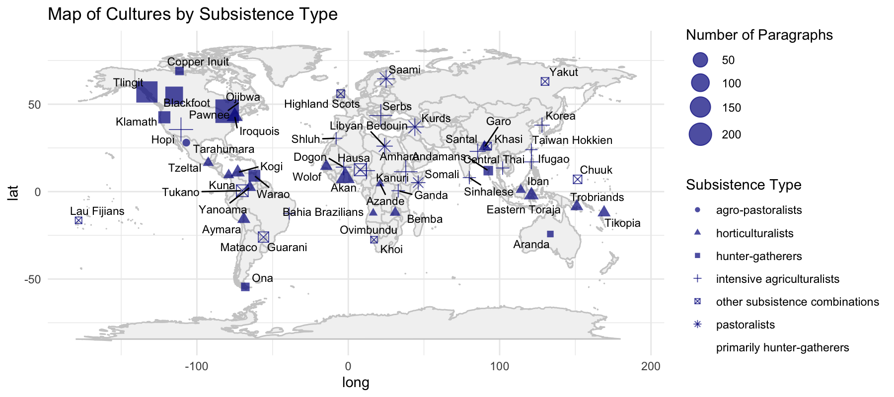
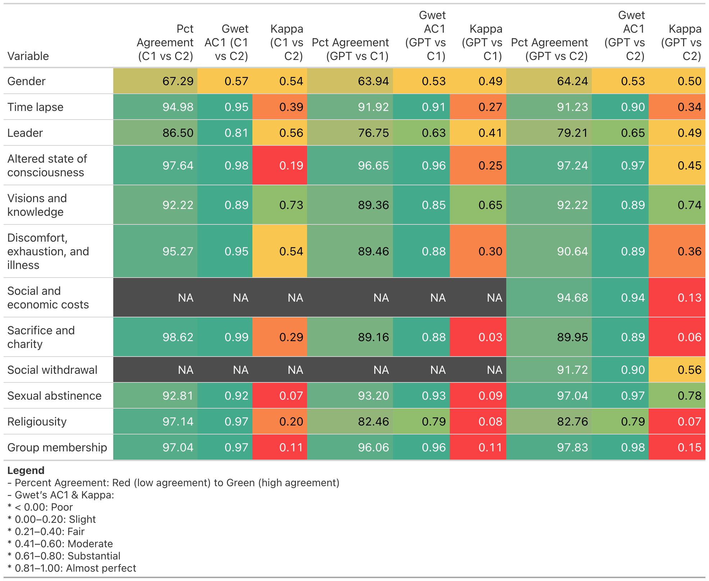

```{r setup, include=FALSE}
knitr::opts_chunk$set(
  echo = TRUE,
  warning = FALSE,
  message = FALSE,
  fig.path = "figures/",
  fig.align = "center",
  fig.width = 6,
  fig.height = 4
)

options(repos = c(CRAN = "https://cloud.r-project.org"))

library(tidyverse)
library(knitr)
library(here)
library(readxl)
library(readxl)
library(gt)
library(irr)
library(irrCAC)

# Load dataset directly into R Markdown
leadup <- read_excel("Datasets/lead_updated.xlsx")

knitr::opts_chunk$set(echo = TRUE)  # Ensures code chunks are displayed
source("IRR subset.R")
source("NEW Classification Tables Resolved Subsets.R")
source("NEW Classification Tables Resolved Gender Subset.R")

set.seed(1234)
```

# Abstract

Large language models (LLMs) can accelerate theory testing and development in the human behavioral sciences. We evaluate GPT-4.0 Turbo's ability to generate binary codes from ethnographic texts on ritual fasting, comparing its outputs to a human consensus subset (n = 225) and to annotations from two independent coders on a larger dataset (n = 1,015). GPT matched or exceeded human performance for well-defined variables and identified systematic omissions in human coding. These labels—capturing constructs such as leadership, sexual abstinence, and resource sacrifice—function as minimal analytic 'units', analogous to pixels in an image. By operationalizing constructs through a binary annotation scheme, LLMs can generate cultural datasets that are well-suited for statistical modeling and comparative analysis. The automation of ethnographic annotation holds great potential for enhancing the speed and scope of cross-cultural research. Realizing this, however, requires ongoing human oversight to define constructs and uphold ethical standards in interpretation and application.

# Introduction

With recent advances in large language models (LLMs), cross-cultural researchers can now investigate human psychology, behavior, and cultural diversity at unprecedented scale [@bail2023; @dubourg2024]. Here, we introduce a conceptual and methodological framework for using LLMs to generate and analyze ethnographic texts for presence–absence data based on theoretical operationalizations that we call 'units of analysis'—binary-coded representations of culture and behavior. These labels—capturing a diversity of constructs such as leadership, sexual abstinence, and resource sacrifice—function as minimal analytic units, analogous to pixels in an image. 

By prompting LLMs with operationalized variables, researchers can automate high-precision annotation of across expansive ethnographic and historical corpora, accelerating the generation of structured representations of culture and behavior [@rathje2024]. When used within a human-in-the-loop framework [@wu2022], LLMs offer a scalable approach to extracting data from unstructured texts, enabling systematic cross-cultural analysis across domains such as cooperation, health, religion, politics, environmental interaction, and ritual practice. We demonstrate this approach by applying GPT-4o to annotate ethnographic descriptions of ritual fasting, showing how LLMs can enhance the efficiency, scale, and theoretical utility of cultural analysis. While our focus is on evolutionary-ecological theories of fasting, the method is broadly applicable to diverse theoretical frameworks.

Like other LLMs, GPT can be guided through natural language prompts, in a manner akin to human instruction, to perform annotation tasks [@rietz2020]; and, social scientists are increasingly adopting these models for this purpose [@balt2025; @tai2024]. GPT has been found to outperform crowd-sourced annotators in both speed and accuracy [@gilardi2023], and GPT models (e.g., GPT-3.5, GPT-4, GPT-4 Turbo) can accurately identify psychological constructs—including sentiment, discrete emotions, offensiveness, and moral content—across diverse text types and languages [@rathje2024]. Although some evidence suggests that GPT-4o struggles to represent nuanced cultural values in free-response text when prompted [@masoud2025], this limitation is potentially less consequential when the model is used to annotate ethnographic texts and the source data itself encodes the relevant cultural context.

Human culture consists of socially transmitted ideas, behaviors, and institutions that operate across multiple levels, shaping individual actions, interpersonal relationships, and societal structures. [@cavalli1981]. Ethnographic texts are a critical source of knowledge of human cultural diversity. LLMs offer a powerful means of identifying and quantifying the form and function of cultural practices by extracting structured data from narrative accounts. Each coded instance—such as a reference to sharing norms, ritual performance, or social roles—represents as a minimal unit of analysis, like a pixel in a digital image. When aggregated and statistically modeled, these data points yield 'snapshots' of cultural systems.

Cross-cultural analysis is essential for distinguishing between universal and culturally specific patterns of behavior, as well as for identifying the ecological, social, and psychological conditions under which particular practices emerge [@ember1998]. Ethnographic texts, as descriptions of the human experience produced by trained anthropologists, offer a window into human cognitions, behaviors, and social systems across diverse cultures over time and space. Although even trained ethnographers are not immune from observational biases, and their perceptions are shaped by their own cultures [@ember1991], their accounts remain essential for testing theories in the human behavioral sciences [@ember2009]. Researchers draw on ethnographic databases to investigate a wide range of topics, including the form and function of leadership [@garfield2020], the ecological predictors of food sharing [@ember2018our], the social conditions of suicidal behavior [@syme2016], and the function of violent rituals, such as pre-war rites [@sosis2007]. Researchers can now leverage large language models to accelerate the speed and scale of ethnographic annotation, thereby expanding the empirical scope for modeling the cultural, ecological, and biological dynamics, that shape human behavior and advancing theory in the behavioral sciences.

To demonstrate the utility of this approach, we focus on deliberate fasting: the intentional abstention from food and drink that alters an individual’s nutritional state [@placek2021]. While often associated with religious observance, such as Ramadan, fasting also appears in diverse cultural contexts, including rites of passage (e.g., Native American vision quests), health practices, and ascetic traditions. These practices vary in frequency, duration, social structure, and physiological consequence. Theories relevant to the function of fasting include: health models [@longo2021], ecological models [@rad2023], and social signaling models, such as group commitment [@henrich2009; @irons2001] and status differentiation [@singh2020]. We apply LLM-based annotation to examine ethnographic descriptions of fasting across cultures, allowing systematic analysis of theoretical predictions of the co-variation of biological, ecological, and social variables. 

# Results

## Geographic Distribution of Cultures and Texts

The dataset comprises 1,236 paragraphs discussing ritual fasting across 56 societies in the context of a wide range of social and religious contexts, including Islamic and Christian traditions, pre-war and hunting rituals, and rites of passage. Accounts of fasting were identified across all major geographic regions and subsistence practices (see Fig. 1). There is extensive coverage of fasting among Serbs and Amhara, each in the context of Orthodox Christianity, as well as among Indigenous North American societies such as the Ojibwa, Tlingit, and Blackfoot, whose accounts frequently reference the vision quest, a rite of passage. By contrast, there were fewer texts from societies in Middle America and the Caribbean and Oceania.


```{r fig-map, echo=FALSE, out.width='100%', fig.cap='World Map showing 56 cultures included in the study'}

```
## Inter-Rater Reliability Between GPT and Human Coders

Table 1 summarizes inter-rater reliability (IRR) metrics from the first round of annotation using GPT-4o to a consensus subset of 225 human-coded observations (see SI for second round of GPT and human consensus IRR). Percent agreement, Gwet’s AC1 (robust to class imbalance), and Cohen’s Kappa (adjusted for chance agreement) were computed for each variable. 

Percent agreement between GPT and human annotators was generally high, ranging from 75.6% (Gender) to 97.8% (Sexual Abstention). Gwet’s AC1 indicated substantial to near-perfect agreement (range: 0.68–0.97), while Cohen’s Kappa indicated more variable reliability (range: 0.19–0.83), consistent with its sensitivity to imbalanced class distributions. 

Cohen’s Kappa coefficients were relatively low despite high Gwet’s AC1 coefficients for the following variables: Time Lapse (.34); Discomfort, Exhaustion, and Illness (.39); Sacrifice and Charity (.19); Religiosity (.21); and Group Membership (.24). This discrepancy reflects the high agreement for 0’s (absence) but low agreement for 1’s (presence) (see next section), which Kappa penalizes.

##Retest Reliability

GPT’s performance across two rounds showed uniformly high agreement (range: 92.9%–99.6%), indicating consistent model behavior. Time Lapse (92.9%), Discomfort, Exhaustion, and Illness (94.2%), Leader (94.7%), showed more variation between the two rounds, and Social and Economic Costs compared to the other variables (see Discussion). Altered State of Consciousness (99.1%), Visions and Knowledge (99.1%), Social Withdrawal (99.6%), and Group Membership (99.1%) had the highest retest reliability with near perfect agreement.

```{r, echo=FALSE,}
# Helper function to calculate IRR stats
get_irr_stats <- function(file, col1, col2, col3, varname) {
  df <- read_excel(file) %>% 
    dplyr::select(all_of(c(col1,col2,col3))) %>% 
    mutate(across(1:3,as.numeric)) %>% 
    slice(-205)
  
  #return(df)
  
  # Agreement with human annotators
  irr1 <- df[1:2]
  agree1 <- agree(irr1)$value 
  ac1_1 <- as.numeric(gwet.ac1.raw(irr1, weights = "unweighted")$est$coeff.val[1])
  kappa_1 <- kappa2(irr1, weight = "equal")$value
  
  # Retest reliability
  irr2 <- df[2:3]
  agree2 <- agree(irr2)$value 
  
  return(data.frame(
    Variable = varname,
    Agreement = round(agree1, 1),
    Gwet_AC1 = round(ac1_1, 2),
    Cohens_Kappa = round(kappa_1, 2),
    Retest_Agreement = round(agree2, 1)
  ))
}

# Collect stats for each variable
irr_table <- bind_rows(
  get_irr_stats("Datasets/gen2irrx2.xlsx", "gender.r", "gen1", "gen2", "Gender"),
  get_irr_stats("Datasets/lead2irrx2.xlsx", "leader.r", "lead1", "lead2", "Leader"),
  get_irr_stats("Datasets/lap2irrx2.xlsx", "time_lapse.r", "lap1", "lap2", "Time lapse"),
  get_irr_stats("Datasets/asc3IRR.xlsx", "asc", "asc2", "asc3", "Altered state of consciousness"),
  get_irr_stats("Datasets/vk2IRR.xlsx", "vk", "vk1", "vk2", "Visions and knowledge"),
  get_irr_stats("Datasets/dei2IRR.xlsx", "dei", "dei1", "dei2", "Discomfort, exhaustion, illness"),
  get_irr_stats("Datasets/se2IRR.xlsx", "se", "se1", "se2", "Social and economic costs"),
  get_irr_stats("Datasets/sca2IRR.xlsx", "sca", "sca1", "sca2", "Sacrifice and Charity"),
  get_irr_stats("Datasets/sw3IRR.xlsx", "sw", "sw2", "sw3", "Social withdrawal"),
  get_irr_stats("Datasets/mat2irr.xlsx", "mat", "mat1", "mat2", "Sexual abstinence"),
  get_irr_stats("Datasets/relx4.xlsx", "rel", "rel2", "rel3", "Religiosity"),
  get_irr_stats("Datasets/gm3irr.xlsx", "gm", "gm1", "gm2", "Group membership")
)

# Display the table
library(knitr)
kable(irr_table, caption = "Agreement and Reliability with Human Annotators and Retest")

```

## Classification Performance: Precision, Recall, and F1

To assess possible human annotation errors, we adjudicated all disagreement cases including examining GPT’s rationale (see Methods). When GPT’s explanation proved more compelling or textually grounded, we revised the labels accordingly, and we created a new variable based on the final verdict called Human-AI resolved.


Figure 4 compares the classification performance (precision in blue, recall in red, and F1 score in green) of two independent GPT annotation runs and the human consensus against human-AI as the ‘ground truth’. The results show that both rounds of GPT have high scores for precision, recall, and the harmonic mean F1 for Altered States of Consciousness, Sexual Abstinence, Social Withdrawal, Visions and Knowledge, Man, Woman, and Both. GPT showed greater variability between the two rounds and reduced precision and recall for Social and Economic Costs. GPT also performed consistently poorly on all metrics for Group Membership. GPT tended to have higher recall at the expense of precision (i.e., many false positives) for the following: Discomfort, Exhaustion, and Illness; Time Lapse; Religiosity; and Visions and Knowledge. GPT performed better than the human consensus on Sacrifice and Charity, though the metrics for all three labels are low due to the fact that GPT picked up on cases that the human annotators missed due to a conceptual ambiguity in the human-devised operationalization (see Discussion for details).


```{r, echo=FALSE, fig.height=8, fig.width=10, include=TRUE}
# List of datasets and variables for batch processing
datasets <- list(
  list(name = "Lead", df = leadup, vars = c("leader.r", "lead1", "lead2"), target = "leader_updated"),
  list(name = "Lap", df = laptf_updated, vars = c("time_lapse.r", "lap1", "lap2"), target = "lap_updated"),
  list(name = "Asc", df = asctf_updated, vars = c("asc", "asc2", "asc3"), target = "asc_updated"),
  list(name = "Vk", df = vktf_updated, vars = c("vk", "vk1", "vk2"), target = "vk_updated"),
  list(name = "Dei", df = deitf_updated, vars = c("dei", "dei1", "dei2"), target = "dei_updated"),
  list(name = "Se", df = setf_updated, vars = c("se", "se1", "se2"), target = "se_updated"),
  list(name = "Sca", df = scatf_updated, vars = c("sca", "sca1", "sca2"), target = "sca_updated"),
  list(name = "Sw", df = swtf_updated, vars = c("sw", "sw2", "sw3"), target = "sw_updated"),
  list(name = "Mat", df = mattf_updated, vars = c("mat", "mat1", "mat2"), target = "mat_updated"),
  list(name = "Rel", df = reltf_updated, vars = c("rel", "rel2", "rel3"), target = "rel_updated"),
  list(name = "Gm", df = gmtf_updated, vars = c("gm", "gm1", "gm2"), target = "gm_updated")
)

# Create an empty list to store results
all_metrics <- list()

# Loop through each dataset and compute metrics
for (dataset in datasets) {
  df <- dataset$df
  vars <- dataset$vars
  target <- dataset$target
  name <- dataset$name

  # Compute precision, recall, and F1-score
  metrics <- data.frame(
    Dataset = name,
    Method = c(paste("Human (", vars[1], ")", sep = ""), 
               paste("GPT (", vars[2], ")", sep = ""), 
               paste("GPT (", vars[3], ")", sep = "")),
    t(sapply(vars, function(var) calculate_metrics(df[[var]], df[[target]])))
  )

  # Rename columns
  colnames(metrics) <- c("Dataset", "Method", "Precision", "Recall", "F1_Score")

  # Store in list
  all_metrics[[name]] <- metrics
}

# Combine all dataset results into a single dataframe
final_metrics <- bind_rows(all_metrics)

# Convert to long format for ggplot
final_metrics_long <- final_metrics %>%
  pivot_longer(cols = c("Precision", "Recall", "F1_Score"), 
               names_to = "Metric", values_to = "Value")

p <- ggplot(final_metrics_long, aes(x = Method, y = Value, fill = Metric)) +
  geom_bar(stat = "identity", position = "dodge") +
  facet_wrap(~ Dataset, scales = "free_x") +
  labs(
    title = "Precision, Recall, and F1 Score by Dataset and Method",
    x = "Method", y = "Score"
  ) +
  scale_fill_manual(values = c("Precision" = "blue", "Recall" = "red", "F1_Score" = "green")) +
  theme_classic() +
  theme(axis.text.x = element_text(angle = 45, hjust = 1)) +
  coord_cartesian(ylim = c(0, 1))  # <- This is the only change


# Display the plot
print(p)

```


```{r, echo=FALSE, fig.height=8, fig.width=10, include=TRUE}

# Initialize an empty list to store all metric results
metrics_list <- list()

# List of datasets and variables for batch processing
gdatasets <- list(
  list(name = "Man", df = gentf_updated, vars = c("genderm.r", "genm1", "genm2"), target = "genm_updated"),
  list(name = "Woman", df = gentf_updated, vars = c("genderw.r", "genw1", "genw2"), target = "genw_updated"),
  list(name = "Both", df = gentf_updated, vars = c("genderb.r", "genb1", "genb2"), target = "genb_updated")
)

# Loop through each dataset and compute metrics
for (dataset in gdatasets) {
  df <- dataset$df
  vars <- dataset$vars
  target <- dataset$target
  name <- dataset$name  # Gender category (Man, Woman, Both)

  # Compute precision, recall, and F1-score
  metrics <- data.frame(
    Model = c("Human", "GPT-1", "GPT-2"),
    Precision = sapply(vars, function(var) calculate_metrics(df[[var]], df[[target]])[1]),
    Recall = sapply(vars, function(var) calculate_metrics(df[[var]], df[[target]])[2]),
    F1_Score = sapply(vars, function(var) calculate_metrics(df[[var]], df[[target]])[3])
  )

  # Add a column for gender category
  metrics$Gender_Category <- name

  # Store in the list
  metrics_list[[name]] <- metrics
}

# Combine all datasets into a single data frame
metrics_data <- bind_rows(metrics_list)

# Convert from wide to long format for ggplot
metrics_long <- pivot_longer(metrics_data, cols = c(Precision, Recall, F1_Score), 
                             names_to = "Metric", values_to = "Value")

# Plot grouped bar chart
p2 <- ggplot(metrics_long, aes(x = Model, y = Value, fill = Metric)) +
  geom_bar(stat = "identity", position = "dodge") +
  facet_wrap(~ Gender_Category) +  # Separate plots for Man, Woman, Both
  labs(title = "Precision, Recall, and F1 Score by Gender Category",
       x = "Model", y = "Score", fill = "Metric") +
  theme_minimal() +
  scale_fill_manual(values = c("Precision" = "blue", "Recall" = "red", "F1_Score" = "green")) +
  theme(text = element_text(size = 14))

# Display the plot
print(p2)

```
## GPT Performance on Unresolved Annotations

The heatmap displayed in Figure 5 is a heatmap of three-way inter-rater reliability and percent agreement metrics comparing two human annotators (Coder 1 and Coder 2) to GPT. Agreement between the two human coders was generally high across most variables, with percent agreement ranging from 67.3% (Gender) to 98.6% (Sacrifice and Charity), and Gwet’s AC1 indicating substantial to near-perfect agreement across variables (range: 0.57–0.99). Cohen’s Kappa was lower for several variables: Sexual Abstinence (0.07), Group Membership (0.11), and Altered State of Consciousness (0.19), reflecting the use of slightly different heuristics to code these variables (See Discussion).

Comparisons between GPT and Coder 1 (C1) showed high levels of percent agreement (e.g., 96.7% for Altered State of Consciousness, 93.2% for Sexual Abstinence), and strong Gwet’s AC1 values for most variables (range: 0.53–0.96). Cohen’s Kappa values were lower (range: 0.03–0.65), with low IRR on Sacrifice and Charity (0.03), Group Membership (0.11), and Religiousity (0.08). Because 0 is the most common value across all datasets, GPT has high agreement on absence (0s) but is more inconcsistent for presence (1s). Conversely, GPT showed moderate to high agreement across all metrics on the following variables: Gender; Time Lapse; Leader; Vision and Knowledge; Discomfort, Exhaustion, and Illness. C1 annotations are missing for Social and Economic Costs and Social Withdrawal due to undercoding, related to the two variables were inductively developed during the coding process.

Comparison of GPT with Coder 2 (C2) revealed similar trends: strong percent agreement and Gwet’s AC1 across most variables (e.g., 97.8% agreement and 0.98 AC1 for Group Membership). There was relatively low Cohen’s Kappa coefficients for Sacrifice and Charity (0.06), Time Lapse (0.34), and Discomfort, Exhaustion, and Illness (0.36). The one exception was Visions and Knowledge, where GPT achieved a relatively high Kappa (0.74) with both human coders, suggesting stronger model reliability for that variable. These results demonstrate GPT's consistent alignment with human judgments on absence of features, and more disagreement in the presence of 1s, which is to be expected (see Confusions Matrices for GPT, C1, and C2 in SI). 
The overall performance of GPT is strong, pariculrly considering that the unresolved annoatations: 1) contain more errors due to attention lapses or typos, 2) reflect the use of different heuristics and constructs between the coders, and 3) are more ambiguous until post-annotation analysis, particularly for inductive variables (see Methods).

```{r include-image, echo=FALSE, out.width="80%"}


```
# Discussion

Our findings demonstrate the capability of GPT-4o to reliably annotate culturally diverse ethnographic data, outperform humans on select variables, and enhance overall annotation accuracy following a human-in-the-loop workflow. In this iterative approach, human expertise and AI-generated insights are combined to refine construct definitions and improve coding reliability [@wu2022]. In finding that GPT-4o can accurately index theoretically relevant content of ethnographic texts from societies that are underrepresented in the human behavioral sciences [@henrich2010; @apicella2020], LLMs offers are a promising tool for accelerating data generation and theory development in cross-cultural research. We propose a novel, scalable application of LLMs in cross-cultural research: the generation of units of culture, in which each coded instance—derived from either deductive or inductive labels, such as cognitive states, ritualized behaviors, biological conditions, or social outcomes—functions as a minimal unit of analysis, like a pixel in a digital image or a stone in a mosaic. When aggregated and modeled statistically, these instances can yield high-resolution ‘snapshots’ of cultural systems, revealing latent patterns in belief, behavior, and social organization. 
Using a binary-coded dataset derived from 56 ethnographic sources, we found that GPT-4o’s performance is on par with human annotators across a range of theoretically relevant constructs. These findings are consistent with mounting evidence that LLMs are starting to achieve human-like performance on annotation tasks [@rathje2024; @balt2025; @balt2024; @xiao2023; @rytting2024]. IRR metrics indicated modest to substantial agreement with humans for multiple variables, including Gender, Leader, Altered State of Consciousness, Sexual Abstinence, Social Withdrawal, and Visions and Knowledge, on both the subset and on the unresolved data. High re-test reliability shows GPT-4o’s internal consistency. Importantly, GPT-4o not only replicated human annotation capabilities but, in the case of Sacrifice and Charity, improved upon it by identifying novel instances that expanded the operational scope of the construct. In this case, GPT identified payments to shamans as a form of resource transfer consistent with the prompt but not with the heuristics the humans were using. The original construct, inductively developed from accounts of charity during Ramadan, did not explicitly include payments to ritual specialists. By identifying these edge cases, GPT challenged a human assumption and helped identify a cultural practice that we would have otherwise missed, thus improving construct validity. Furthermore, in adjudicating all disagreements on the human consensus subset to create a Human-AI resolved ‘gold standard’, we found that GPT-4o was often correct and even outperformed humans in the case of Social Withdrawal (see Fig. 4).

GPT tended to have higher recall and lower precision, whereas human annotation tended to have higher precision and lower recall (see Fig. 4). In other words, GPT-4o tended to err on the side of overcoding, whereas the human annotators were more cautious. GPT-4o more often would annotate if the variable topic was mentioned even if it was not relevant to fasting, whereas humans were better at avoiding those errors. However, this proved to help balance out the cautious annotations of the coders, and GPT-4o sometimes identified cases that the humans missed (see SI). GPT-4o performed relatively poorly on Social and Economic Costs and Discomfort, Exhaustion, and Illness, likely, because the prompt contained too many distinct and even opposing elements, including reputational costs for both fasting too much or not at all in addition to economic costs like loss of business (see Table 2).

GPT-4o’s comparatively low agreement with human coders on Group Membership and Religiosity is partly attributable to the relatively low frequency of ethnographic texts that clearly meet the operational criteria for these constructs. There are clear instances of texts that meet the operational definition. For example, the human consensus and both rounds of GPT identified the following for Group Membership: “…the violation of the Islamic regulation oppresses him. He feels like an apostate and separated from his comrades (see SI).” From this negative instance, in which breaking the fast resulted in feelings of alienation, both human coders and GPT-4o inferred that fasting serves as a mechanism of group cohesion and belonging. More often, however, group membership and religiosity were implicit rather than explicit in the texts. For Religiosity, GPT-4o’s rationale for coding positive instances often included cases where fasting was listed alongside other religious practices (see SI), not that fasting serves as a signal that one is pious or religious per se (see Table 2). This distinction is important, because it is known that fasting is often tied to religious traditions. What is theoretically significant to test is the extent to which the act of fasting distinguishes individuals by social group, leadership status, or religious conviction [@singh2020; @henrich2009; @sosis2007], as in the following positive instance of Religiosity: “Religious knowledge and piety, as evinced through such meritorious acts as… obligatory fasts (see SI).” Additional strategies to identify cases of Religiosity or Group Membership could prompt the LLM to measure secondary indices, such as quantifying the proportion of a text containing religious themes or references to markers of group identity. Another strategy is to expand the ethnographic source data and include a culturally representative sample of ethnographies that have a dedicated focus to the topic of fasting and describe social contexts in great detail [e.g., @moller2005; @vallely2002]. 

In the context of ethnographic annotation, each presence label—or ‘1’—can be interpreted as a theoretically meaningful ‘unit’ of cultural expression, reflecting the instantiation of latent dimensions [see also @jajoo2025]. These ‘units’ offer an architecture for both confirmatory and exploratory research on latent cultural dimensions—transforming ethnographic descriptions into interoperable, theory-driven data suitable for quantitative modeling. We contend that a binary approach (presence/absence), as opposed to using Likert-scales, will reduce ambiguity, as prior results comparing LLMs to human performance on assigning Likert ratings found that LLMs were more likely to assign extreme scores [@martinez2025], introducing noise. Rather than assessing the strength or subtlety of a construct on a scale, we recommend measuring intensity by aggregating the number of occurrences across different levels of analysis—paragraphs, documents, cultures, or regions, allowing researchers to approximate relative emphasis without relying on subjective gradations. LLMs can also annotate meta-textual features, such as the account’s temporal proximity to the events described (e.g., Time Lapse), the evidentiary basis of an account (firsthand versus secondhand), and the presence of interpretive bias that are informative of the quality and reliability of the data. When aggregated across societies, these 1’s enable testing theories of human behavior and mapping the patterning and distribution of cultural practices [see e.g., @syme2016]. Statistical methods to analyze this type of data include heatmaps to visualize co-occurrence patterns, principal component analyses (PCA) to uncover latent dimensions, and phylogenetic approaches to model cultural transmission and change over time [@ringen2019; @minocher2019; @hrnvcivr2020]. Together, these methods provide a framework for modeling dynamics between cultural practices and ecological, social, or historical variables, by accounting for underlying structural dependencies and controlling for confounding influences.

The present analysis is intended as a proof of concept, focused on a subset of 12 categorically distinct variables (drawn from over 70 in the full dataset), to evaluate GPT-4o’s annotation performance relative to human coders across a range of theoretically relevant constructs. Future work will extend LLM-assisted annotation across the complete set of fasting-related variables in the HRAF Fasting Project. This expanded dataset will provide the scale and resolution necessary for applying the statistical approaches outlined above—including multivariate and phylogenetic models—to formally test hypotheses and model the co-occurrence and distribution of cultural features across diverse societies.

Overall, GPT-4o offered rationale for its responses based on patterns it had learned from extensive pretraining on large-scale textual corpora (e.g., Wikipedia), which include diverse sources of cultural knowledge. GPT, for instance, accurately interpreted terms from diverse languages, such as words for leaders or ritual practices. In four cases, GPT-4o showed bias against women leaders with GPT acknowledging “holy person” as status titles but not “holy woman” (see SI); thus, if automated across a novel set of text to annotate, these results suggest that this model might systematically underrepresent women in leadership. This bias might be due to the fact that previous ethnographic research using similar annotation methods, but with human annotators only, found that in small-scale societies, men are more often political leaders than women [@garfield2020], and thus GPT-4o is possibly injecting this expectation into the annotation process based on pre-training [@dubourg2024]. Nevertheless, GPT’s performance on complex interpretive tasks is likely to improve with subsequent model generations, as prior research demonstrates systematic advances in the accurate representation of human-defined constructs [@rathje2024]. This includes compliance with instructions to restrict analysis to textual context and to avoid inferential reasoning—an instruction GPT-4o frequently failed to observe (see SI).

LLMs can serve as a means to address Western bias in the human behavioral sciences by dramatically accelerating the annotation of ethnographic texts, incorporating data from a broader spectrum of cultural contexts and supporting the development of more generalizable theories of human behavior [@henrich2010; @apicella2020]. However, realizing this potential requires attentiveness to the ethical implications of integrating AI into cross-cultural research. To ensure that such research is conducted ethically, we outline a set of actionable recommendations informed by UNESCO’s principles for global AI ethics [@unesco2023] and recent guidelines from the scientific community. In alignment with the principles of responsibility and transparency, researchers should adopt open science practices—making data, code, and annotation protocols publicly accessible [@haibe2020]—and clearly disclose which components of the research pipeline were carried out by humans versus AI models [@knoechel2024]. While LLMs might be more ecologically sustainable than travel-intensive fieldwork, researchers must remain mindful of computational resource use. In line with the principle of proportionality, AI actors should favor energy-efficient methods [@unesco2023].

Ensuring fairness and non-discrimination requires human oversight, culturally diverse data, and careful interpretation to avoid reproducing bias [@grossmann2023]. Central to this is adaptive, multistakeholder governance: researchers should collaborate with represented communities not merely as subjects but as co-creators [@lenette2022]—shaping research questions, validating findings, and the co-production of cultural knowledge [@urassa2021]. Promoting cultural awareness among researchers and AI literacy among both researchers and community stakeholders is also essential for ensuring equitable representation in AI-driven research, guiding the ethical use of AI, and resisting the impact of ‘technocoloniality’ [@mboa2023].

Taken together, these findings suggest that LLMs—particularly GPT-4o and beyond—are capable of reliably coding complex, culturally diverse ethnographic data in ways that support both theory testing and development in the human behavioral sciences. By operationalizing constructs through a binary annotation scheme, LLMs can generate high-resolution cultural datasets that are well-suited for statistical modeling and comparative analysis. The automation of ethnographic annotation through LLMs holds the potential to accelerate inclusive, cross-cultural research, but realizing this potential responsibly will require sustained oversight of human domain experts to define constructs, adjudicate ambiguity, and ensure that ethical standards guide the interpretation and application of AI-generated insights.


# Methods

## Ethnographic Text Extraction

We extracted data from the Probability Sample Files (PSF) within the electronic Human Relations Area Files (eHRAF), using the search term “fast*”. Only texts referring specifically to abstention from food or drink were retained. This yielded 1,236 paragraphs from 56 societies represented in the PSF. The PSF is a stratified random sample comprising 60 cultures drawn from 60 global regions, selected based on data quality criteria such as ethnographer fluency in the local language (see HRAF documentation). Each paragraph is accompanied by author, publication title, publication year, field dates, and culture.
Additionally, two cultures not included in the PSF—Khoi and Warao—were inadvertently included. We decided to retain these texts despite the error to increase the sample size for GPT model testing.

## Theoretical Operationalizations and Manual Coding

Theoretical operationalizations were devised using a deductive approach for some and an inductive approach for others. Deductively derived variables were operationalized and the texts were annotated for the presence or absence (1 or 0) of that variable. For instance, we initially coded for the presence or absence of health and social costs, and in an adjacent column, we recorded the types of health and social costs discussed in texts, such as illness, tiredness, punishment. Other variables were identified during the coding process, we noticed that texts often mentioned cognitive states such as trance, meditation, or dreams, so we added a Cognitive State variable and documented types of cognitive states described from the text.
Initial annotation was performed independently by two researchers (CP and KS), including deductive and inductive codes. Post-annotation, KS combined unique annotations into categories. We aimed to ‘carve nature at its joints’. When consolidating the variables, the goal was to balance distinctions between phenomena of potential theoretical significance, while keeping in mind that having variables that are too fine-grained results in lower observations for each variable and increases the dimensionality of the dataset. For instance, "thirst" and "hunger" were grouped as indicators of biological cost, and regarding cognitive states, a distinction was drawn between descriptions of altered states of consciousness, like trance, which are externally observable and descriptions of visions and knowledge acquisition, which are internally experienced (see Table 2). 

```{r, echo=FALSE, fig.height=8, fig.width=10, include=TRUE}
table2 <- tribble(
  ~`Variable Type`, ~`Variable Name`, ~`Variable Description`,
  "Characteristics of Fasters", "Gender", "The gender of the faster: 1 = Man, 2 = Woman, 3 = Both, 0 = Unknown",
  "", "Leadership", "If the faster is a political or religious leader",
  "Quality of Account", "Time Lapse", "If the text describes fasting that occurred in the past and is no longer practiced",
  "Cognitive States", "Altered State of Consciousness", "Trance, ecstatic, meditation, contemplative, peacefulness, hypnotism, lose consciousness, concentration",
  "", "Visions and Knowledge", "Dreams, prophecy, hallucinations, perceptions, insights, learn things, creativity, clarity",
  "Direct Costs", "Discomfort, Exhaustion, and Illness", "Work is more arduous, weariness, thirst, hunger, suffering, self-mortification, self-torture, illness, driven to madness, mental unbalance, anger",
  "", "Social and Economic Costs", "Vulnerable to attack, loss of business, selfishness, blamed for failed hunts due to not fasting, social conflict",
  "Indirect Costs", "Sacrifice and Charity", "Redistribute/give away resources (e.g., money, horse), *paying a fee to a ritual specialist*",
  "", "Social Withdrawal", "Isolation/seclusion, inactivity, lost in wilderness",
  "", "Sexual Abstinence", "Restrictions on sexual activity, affects marriage timing",
  "Signal Type", "Religiosity", "Piety, devotion to God or beliefs",
  "", "Group Membership", "Group solidarity or commitment, belonging to a group"
)

knitr::kable(table2, caption = "Table 2: Sample of Operationalized Variables on Fasting", longtable = TRUE, booktabs = TRUE)

```

## Prompt Engineering

Prompt engineering—the iterative process of designing inputs to optimize model output [@marvin2023]—was carried out primarily using R (see Supplementary Information). To evaluate the capabilities of GPT-4.0 in ethnographic text annotation, we selected a subset of variables reflecting key theoretical dimensions of fasting and its representation in cross-cultural research (see Table 2). In aiming to sample the diversity of the types of phenomena captured by these texts, we chose variables that index: characteristics of fasters, the quality of the account, direct and indirect costs of fasting (biological, social, and economic), and communicative signal types (does the act of fasting communicate something to others?).
Following procedures outlined in @dubourg2024, we refined prompts through repeated trial and error to assess GPT-4.0’s annotation accuracy. This approach uses Parameter-Efficient Fine-Tuning (PEFT), which allows models to be adapted to new tasks by adjusting only a small number of parameters, such as prompts rather than retraining the entire model. @liu2021 demonstrated that optimized prompt tuning can achieve results comparable to full fine-tuning, evidencing the efficiency and effectiveness of prompt-based approaches for adapting large language models to specialized tasks like ethnographic annotation. 

Initial prompts were constructed based on operational definitions used by human coders. These were implemented through an R script that accessed GPT-4.0 via OpenAI’s API. We also conducted exploratory prompt testing using OpenAI’s web interfaces (Playground and ChatGPT), recognizing that these might rely on earlier models (e.g., GPT-3.5). Throughout the process, prompt formulation was revised in response to GPT’s performance. Researchers manually reviewed both successful and failed outputs to identify systematic sources of error, such as misattribution or misinterpretation. When GPT’s outputs were incorrect, we analysed its own rationales to better understand the model’s reasoning and guide further prompt refinement. GPT’s suggestions for revising prompts were also tested, although these were inconsistently helpful. To avoid overfitting prompts to specific examples, we assessed performance across diverse texts and prioritized simplicity and clarity [see @dubourg2024]. While GPT can process multi-criteria instructions, overly complex prompts tended to degrade performance. Thus, effective prompt design required balancing comprehensiveness with cognitive parsimony.

## GPT Annotation Procedure

We applied GPT-4.0 to a subset of annotated paragraphs (n = 225), running each variable prompt at least twice. If initial agreement with human annotations was low, we revised the prompt and re-ran the model. Once a prompt yielded satisfactory agreement, it was re-tested using the most successful version, with GPT also instructed to provide a rationale for each response across disagreements (see SI). To ensure consistency across outputs, the temperature parameter was set to 0 for all API calls, minimizing randomness of model's responses.

Agreement and inter-annotator reliability metrics were calculated after each round. Discrepancies between GPT outputs and human consensus annotations were reviewed manually. In several cases, GPT identified patterns overlooked by human annotators, prompting revisions to our ground truth. Notably, while our initial operationalization of Sacrifice and Charity focused narrowly on religious donation, GPT repeatedly included other forms of resource transfer, such as payments in healing and ritual contexts. These were judged valid upon review and incorporated into an updated gold standard. Final model performance was assessed using precision, recall, and F1 scores, based on alignment with this human-AI consensus benchmark.

For variables that had shown weaker performance during testing—such as Social and Economic Costs and Group Membership—prompts were further revised before the final model run. We then deployed the prompts across the remaining 1,015 unannotated paragraphs. Model outputs for this larger dataset were evaluated to determine the generalizability of prompt performance to unseen data.
